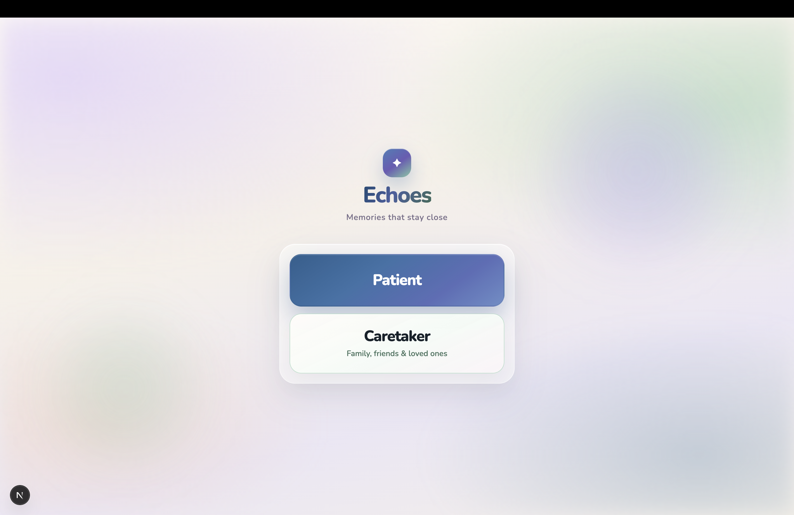
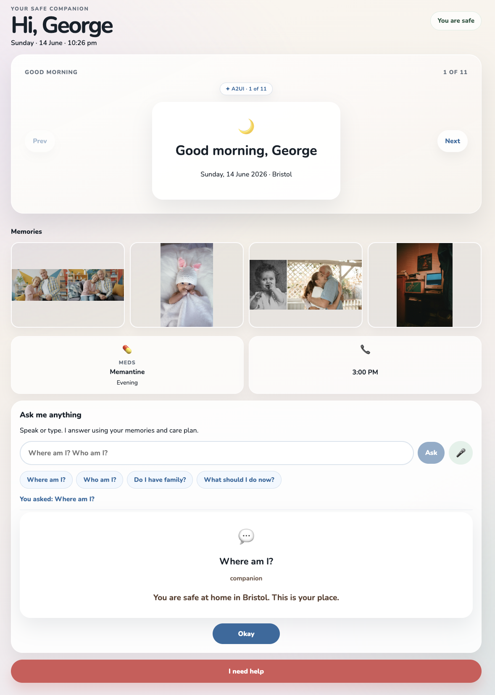
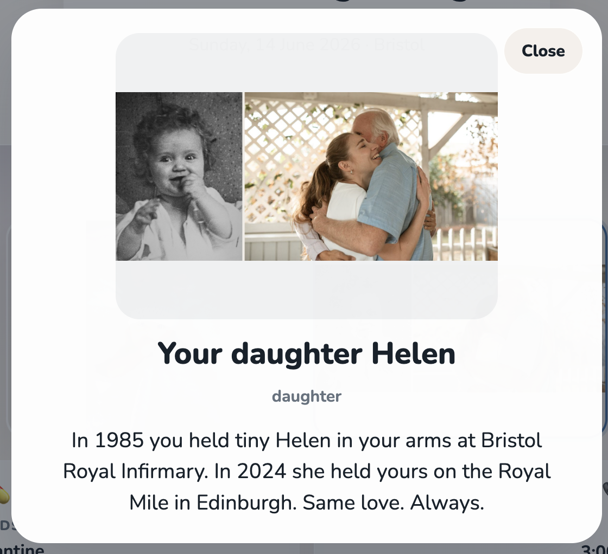
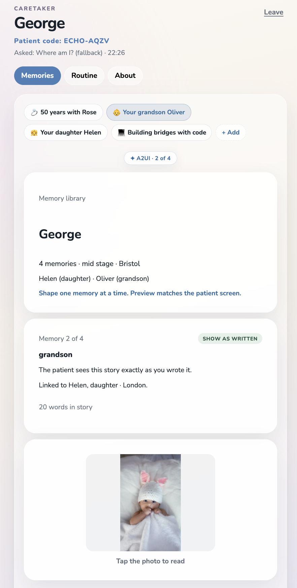
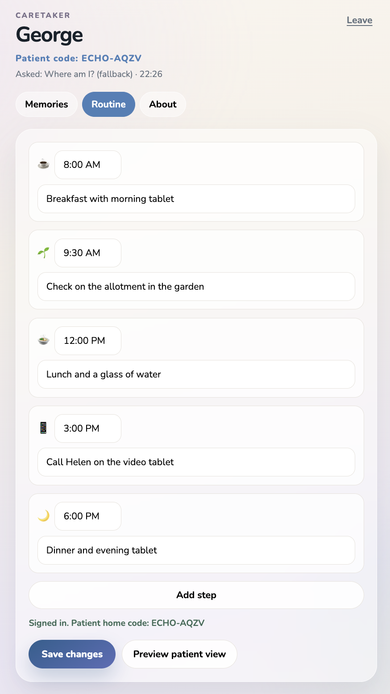
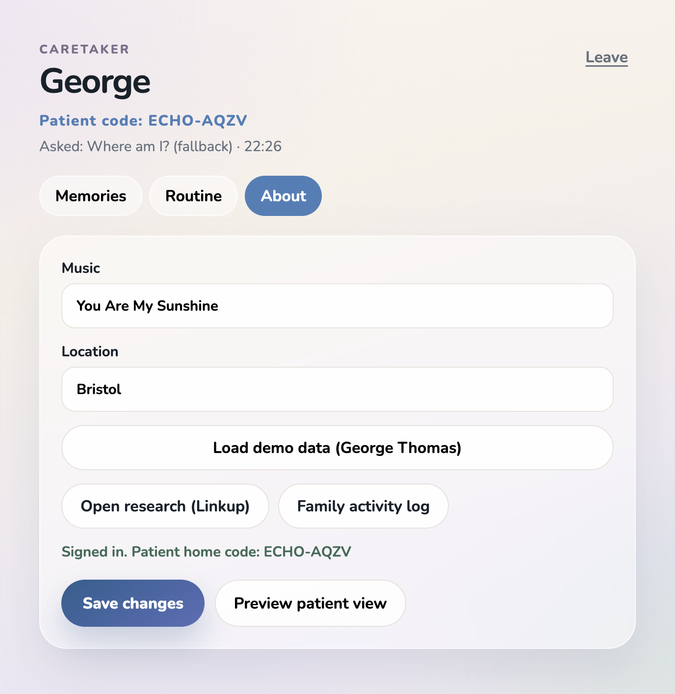
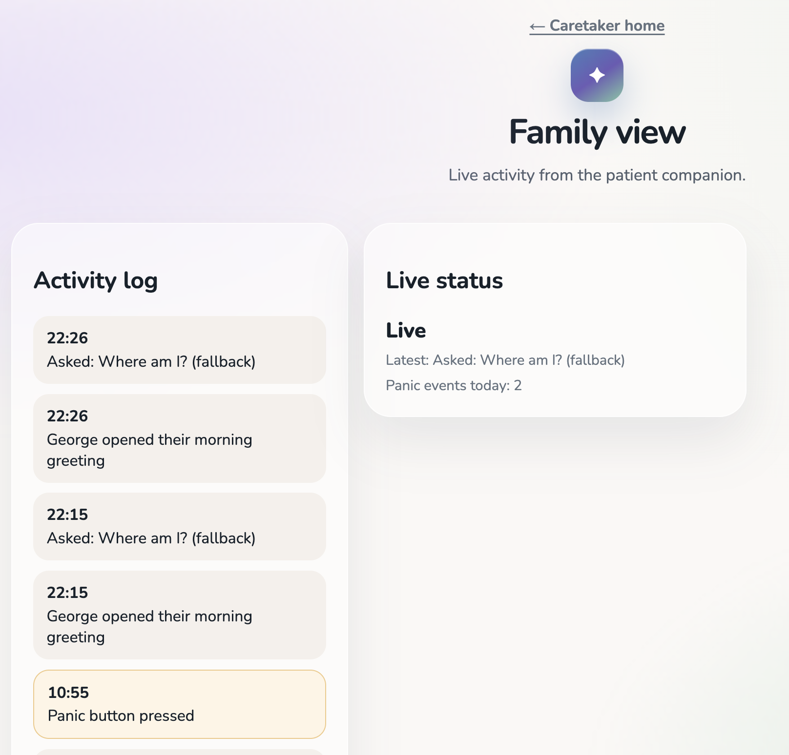

# Echoes

Echoes is an adaptive care companion for people who need calm, familiar support through the day. A caregiver uploads a care plan PDF, the system turns it into a personalized experience, and the patient sees a simple, reassuring interface that changes with their needs.

It combines:

- **CopilotKit + AG-UI** for live agent-to-UI streaming
- **A2UI** for declarative generative UI cards
- **FastAPI** for the Python agents
- **Next.js** for the app shell
- **Linkup** for research and music discovery
- **ElevenLabs** for calming voice output
- **Google Gemini 3.5 Flash** as the frozen model behind the agents

## Tags

`generative-ui` `a2ui` `copilotkit` `ag-ui` `nextjs` `fastapi` `langgraph` `gemini` `elevenlabs` `linkup` `accessibility` `healthtech` `hackathon`

## Description

This project is built for a London hackathon demo, but the idea is practical: one uploaded care plan becomes a tailored patient screen, a family monitoring view, and a caregiver research assistant.

The core flow is:

1. Caregiver uploads a PDF care plan on `/setup`
2. The setup agent extracts a structured patient profile
3. The patient page renders one A2UI card at a time on `/patient`
4. Panic mode switches the interface into a calming flow with voice and music
5. The family page shows activity history and live status on `/family`
6. The research page provides cited guidance on `/research`

## Screenshots

### Landing screen

<p align="center">
  
</p>

### Patient experience

<table>
  <tr>
    <td width="50%">
      
    </td>
    <td width="50%">
      
    </td>
  </tr>
</table>

### Family monitoring

<table>
  <tr>
    <td width="50%">
      
    </td>
    <td width="50%">
      
    </td>
  </tr>
  <tr>
    <td width="50%">
      
    </td>
    <td width="50%">
      
    </td>
  </tr>
</table>

## Features

- Care plan PDF upload and profile extraction
- Personalized patient onboarding and adaptive home screen
- One-card-at-a-time A2UI rendering for better cognitive accessibility
- Memory prompts, daily tasks, and medication reminders
- Panic mode with calming language and voice playback
- Music discovery for reassurance and grounding
- Research assistant with cited guidance
- Family dashboard with activity log and live status

## Tech Stack

- **Frontend:** Next.js 15, React 19, TypeScript
- **Backend:** FastAPI, Python, LangGraph
- **Agent transport:** CopilotKit v2, AG-UI
- **UI system:** A2UI
- **AI services:** Google Gemini 3.5 Flash, Linkup, ElevenLabs
- **Utilities:** pdfjs-dist, Redis support, Zod

## Project Structure

```text
src/
├── app/
│   ├── setup/page.tsx
│   ├── patient/page.tsx
│   ├── family/page.tsx
│   └── research/page.tsx
├── a2ui/
│   ├── theme.css
│   └── catalog/
├── components/
└── lib/

agent/
├── main.py
└── src/
    ├── patient_agent.py
    ├── research_agent.py
    ├── setup_agent.py
    └── catalog.py
```

## Getting Started

```bash
pnpm install
cp .env.example .env.local
pnpm doctor
pnpm dev
```

For local development without external model calls:

```bash
OFFLINE=1 pnpm dev
```

## Environment Variables

Create a `.env.local` file with the keys you need:

```bash
GEMINI_API_KEY=your_key_here
LINKUP_API_KEY=your_key_here
ELEVENLABS_API_KEY=your_key_here

PATIENT_AGENT_URL=http://localhost:8123/patient
RESEARCH_AGENT_URL=http://localhost:8123/research
SETUP_AGENT_URL=http://localhost:8123/setup
```

## Commands

| Command | Purpose |
|---|---|
| `pnpm dev` | Start Next.js and the Python agent together |
| `pnpm dev:web` | Start only the Next.js app |
| `pnpm agent` | Start only the Python agent |
| `pnpm doctor` | Run the environment preflight check |
| `pnpm smoke` | Run the full smoke test gate |
| `pnpm typecheck` | TypeScript typecheck |
| `pnpm test` | Run runtime tests |
| `pnpm validate-widget <path>` | Validate an A2UI component |

## Demo Flow

1. Open `/setup` and upload the demo care plan PDF.
2. Review the extracted profile and approve it.
3. Open `/patient` to show the personalized briefing and memory cards.
4. Trigger panic mode to demonstrate calming voice and music.
5. Open `/research` and ask a clinical or family support question.
6. Open `/family` to show the live activity log and status panel.

## Notes

- The patient experience is intentionally simple, warm, and low-friction.
- The A2UI catalog is the source of truth for all patient-facing cards.
- The screenshots in `/img` are meant to be committed and displayed in the README.
- If a layout issue appears in an A2UI component, run `pnpm validate-widget <path>` and then `pnpm smoke`.

## Sponsor Footer

Built for the London A2A + Generative UI hackathon with:

- **CopilotKit + AG-UI** for the live agent stream
- **A2UI** for declarative generated UI
- **Linkup** for research and music discovery
- **ElevenLabs** for calming voice output
- **Google Gemini 3.5 Flash** as the model behind the agents

